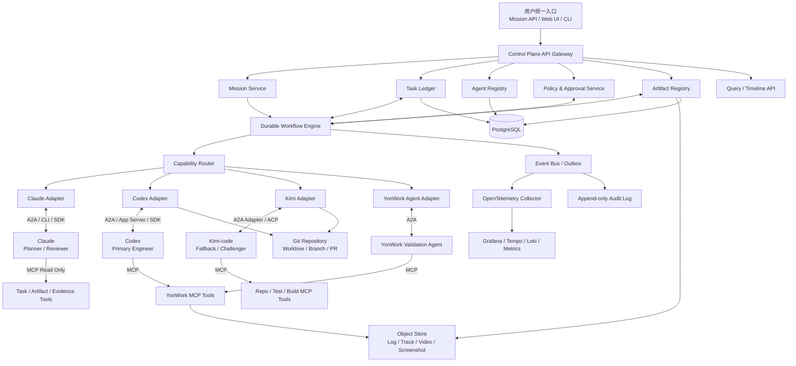
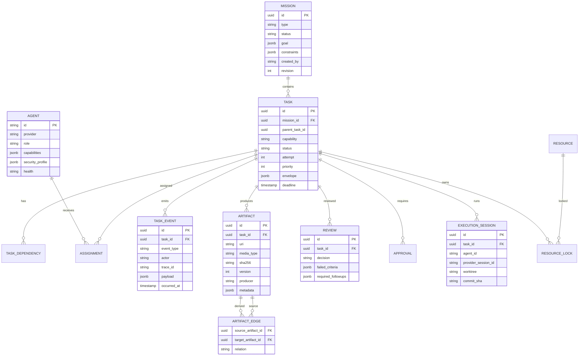
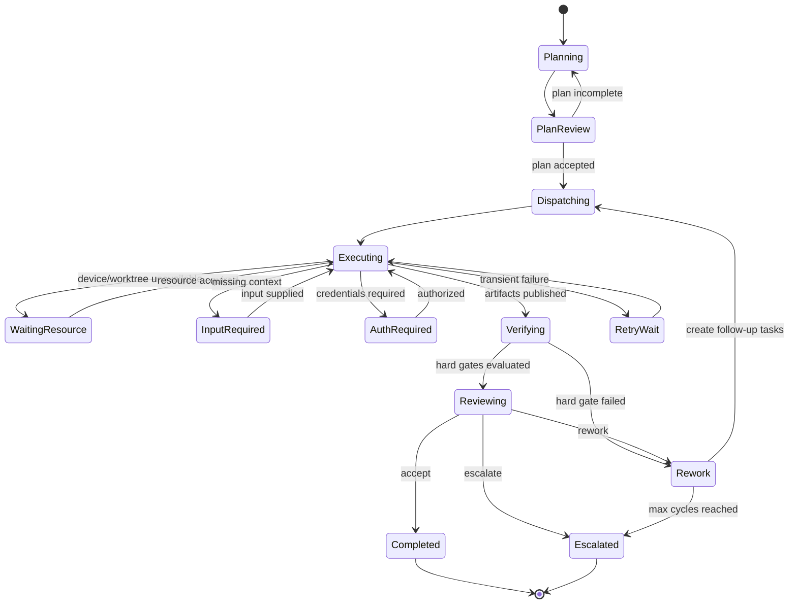
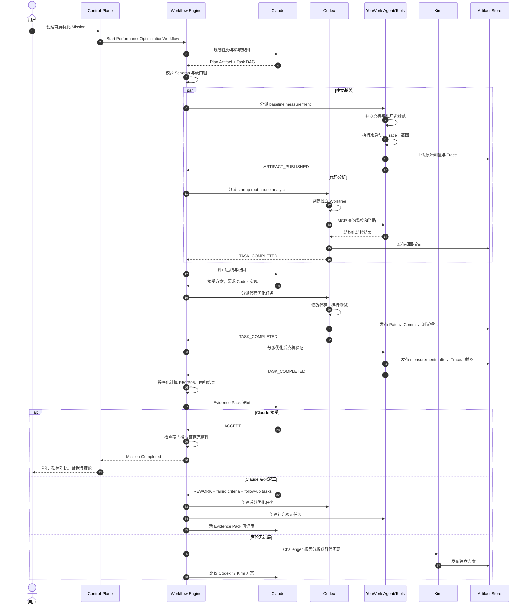

# 多 Agent 控制平面架构研究与落地技术报告

## 执行摘要

本报告面向一个已有四类 Agent 的研发体系：

| Agent | 主要角色 | 建议职责边界 |
|---|---|---|
| Claude | 规划、问题分析、任务分解、方案评审 | Planner、Architect、Reviewer、Judge |
| Codex | 主力开发、Bug 修复、真机操作、YonWork 联调 | Primary Engineer、Lab Operator |
| Kimi-code | 备选开发、替代方案、独立审查 | Fallback Engineer、Challenger |
| YonWork | 实机验证、软件操作、调试诊断监控 | Validation Agent、Device Tool Provider |

当前主要问题不是模型能力不足，而是缺少一个独立于任何单一模型的**控制平面**：任务由人手工转发、上下文依赖文档位置、验证结果缺少统一证据模型、返工依赖人工协调、Agent 之间即使能够通信也缺少审计、权限和失败恢复机制。

本报告的核心建议是建设一套 **Agent Control Plane**，采用以下职责分层：

> **A2A 负责 Agent 对 Agent 的任务委派；MCP 负责 Agent 对工具、数据和环境的调用；持久化工作流引擎负责流程状态、等待、重试、返工和人工审批；Task Ledger 与 Artifact Store 负责共享事实、证据和审计。**

截至 2026 年 8 月 1 日，A2A 最新正式版本为 1.0.0，已定义 Agent Card、Task、Message、Artifact、流式更新、异步通知和多种协议绑定，适合作为异构 Agent 间的互操作协议。MCP 最新规范为 `2026-07-28`，协议核心已改为无状态模式，并通过可选 Tasks 扩展支持长任务、轮询、途中补充输入和持久化句柄；但 MCP 的主要抽象仍是模型或 Agent 与工具、资源和外部能力的连接，而不是完整的跨 Agent 工程治理系统。citeturn5view0turn5view4turn8search2

推荐的目标架构不是“让四个 Agent 进入一个群聊”，而是：

- 所有 Agent 通过统一的任务信封接收工作；
- 所有状态变更写入不可丢失的事件账本；
- 所有代码、日志、Trace、截图和报告以 Artifact 注册；
- Claude 的“不满意”必须输出结构化验收缺口和返工任务；
- Codex 和 Kimi 使用独立 Git Worktree，避免并发污染；
- YonWork 真机和测试租户作为受控资源，必须申请资源锁；
- 高风险操作进入人工审批节点；
- Agent 可以直接通信，但每次委派都必须经过控制平面授权并留下因果链。

### 推荐结论

在预算、团队规模和既有基础设施均**未指定**的前提下，默认推荐：

| 层级 | 推荐技术 |
|---|---|
| 控制平面服务 | TypeScript、NestJS 或 Fastify |
| 持久化编排 | Temporal |
| 元数据与任务账本 | PostgreSQL |
| 大文件与证据 | MinIO 或兼容 S3 的对象存储 |
| 代码与文档 | Git、独立 Worktree、PR |
| Agent 协议 | A2A 1.0，首期可由内部 Adapter 模拟 |
| 工具协议 | MCP `2026-07-28`，兼容现有旧版客户端 |
| 身份权限 | OIDC/OAuth 2.1、短期工作负载令牌、策略引擎 |
| 观测 | OpenTelemetry、Prometheus、Grafana、Tempo、Loki |
| Agent 接入 | Claude CLI/SDK Adapter、Codex SDK/App Server Adapter、Kimi ACP Adapter、YonWork A2A/MCP Adapter |

Temporal 的 Workflow Execution 是持久化、可恢复的执行单元，服务端保存 Event History，Worker 故障后可通过历史重放继续执行，适合多轮返工、长时间真机占用、等待授权和跨天恢复。citeturn0search2turn0search6turn0search29

在一个约 **四名全职等效人员**的假设团队下，建议先用 **六至八周**交付可运行 MVP，再用 **四至八周**完成多 Agent 自主路由、Kimi 主备、权限强化和生产级观测。若只有一至两名工程师，时间通常需要扩展到十二至二十周。上述人力和时间是工程估算，不代表厂商承诺。

## 设计边界与总体架构

### 设计原则

控制平面应遵循以下原则：

| 原则 | 含义 |
|---|---|
| LLM 决策、引擎执行 | Agent 可以建议下一步，但不能自行充当可靠数据库或消息队列 |
| 共享事实而非共享聊天 | 协作以 Task、Event、Artifact、Review 为中心 |
| 明确任务所有权 | 每个任务只有一个当前责任 Agent，其他 Agent 通过子任务或评审参与 |
| 默认可恢复 | 每一步都允许 Worker、网络、设备或模型会话中断后继续 |
| 默认可审计 | Agent 的输入、输出、工具调用、权限决策和 Artifact 都可追踪 |
| 默认最小权限 | Agent 只能取得当前任务所需的资源、环境和时间有限权限 |
| 硬指标程序判断 | P95、测试通过率、Artifact 完整性等由确定性程序判断 |
| 软判断模型评审 | 架构合理性、风险解释、方案质量由 Claude 或 Challenger 判断 |
| Agent 直接通信必须受控 | 通信可以点对点，但路由、身份、授权和事件必须经过控制平面 |

A2A 明确支持异构、相互不透明的 Agent 发现能力、管理协作任务，并在不访问对方内部状态、内存或工具的情况下交换信息；其长任务可以通过轮询、SSE 或 Push Notification 获取进展。citeturn5view0turn6view1turn5view3

### 目标架构



### 控制平面与 Agent 的责任边界

控制平面负责：

- Mission 创建和版本管理；
- 任务 DAG、状态机和依赖；
- Agent 能力注册、健康状态和路由；
- 超时、重试、主备切换和熔断；
- Artifact 注册、哈希、版本和血缘；
- 真机、租户、账号、Worktree 等资源锁；
- 审批、授权和令牌下发；
- 事件日志、追踪、成本和质量指标；
- 最大返工次数、预算和无进展检测。

Claude 负责：

- 将目标转化为假设、计划、任务 DAG 和验收条件；
- 对 Evidence Pack 进行结构化评审；
- 输出 `accept`、`rework` 或 `escalate`；
- 在 `rework` 时指出失败标准、证据缺口和精确子任务；
- 不直接持有控制平面的持久状态。

Codex 负责：

- 主力代码分析、实现、测试和真机联调；
- 在分配的 Worktree 中写代码；
- 调用授权的 YonWork MCP 工具；
- 发布 Patch、Commit、测试报告和分析结果；
- 根据返工任务恢复已有会话继续工作。

Codex 官方目前提供 App Server、SDK 和非交互执行能力；非交互模式可通过 JSON Schema 约束最终输出，App Server 可生成与当前 Codex 版本匹配的 TypeScript 或 JSON Schema。citeturn2search1turn2search7turn2search13

Kimi-code 负责：

- Codex 失败时接管；
- 对高风险修改提供独立根因分析；
- 作为 Challenger 审查 Codex 方案；
- 在独立 Worktree 中产生备选实现；
- 不直接覆盖 Codex 分支。

Kimi Code CLI 的 `kimi acp` 通过 stdin/stdout 上的 JSON-RPC 与 ACP Client 通信，适合作为本地 Agent 适配接口；因此建议在其外部增加 A2A Adapter，而不是直接把 ACP 当成企业级 Agent 间主协议。citeturn2search2turn2search20

YonWork 建议拆为两个逻辑层：

- **YonWork MCP Tool Server**：确定性操作，如启动、登录、清缓存、打开页面、采集 Trace、查询监控、截图、导出日志。
- **YonWork Validation Agent**：需要自主判断和多步执行的验证，例如执行二十次冷启动、处理异常样本、关联监控链路、生成验证结论。

用户现有 YonWork 的具体公共 API、部署方式和鉴权能力均为**未指定**。落地时需要先完成内部能力清单和 Adapter SPI，不应假定 YonWork 已原生支持 A2A 或最新版 MCP。

### 核心数据关系



## 协议适配与任务模型

### A2A 与 MCP 的分工

A2A 1.0 将 `Task` 定义为有状态工作，具有服务端生成的任务 ID、上下文 ID、状态、Artifact 和历史；它还定义 `submitted`、`working`、`completed`、`failed`、`canceled`、`input-required`、`rejected` 和 `auth-required` 等状态。A2A 的 `contextId` 可将多个独立或并行 Task 归入同一交互上下文。citeturn6view0turn5view2

MCP 的主要角色是 Host、Client 和 Server，Server 向模型或 Agent 提供 Tools、Resources 和 Prompts。`2026-07-28` 版本移除了协议级 Session 和 `Mcp-Session-Id`，每个请求携带版本和能力信息；需要跨调用状态的 Server 应返回显式句柄，由后续 Tool 参数传回。citeturn5view4turn5view5turn8search4

MCP Tasks 扩展能够为工具等请求增加持久化任务句柄，但该扩展仍由请求方驱动轮询，且官方路线图仍列出了重试语义、结果过期和企业级审计等待完善问题。因此，它适合作为“长时间工具调用”的能力，但不应代替整个 Mission、DAG、审批、路由、Artifact 血缘和自动返工控制平面。citeturn8search2turn8search3turn8search7

推荐适配矩阵：

| 调用关系 | 建议协议 | 原因 |
|---|---|---|
| 控制平面 → Claude | A2A Adapter 或 SDK/CLI Adapter | 长任务、评审、状态更新 |
| 控制平面 → Codex | A2A Adapter 封装 Codex SDK/App Server | 保留统一任务和事件模型 |
| 控制平面 → Kimi | A2A Adapter → ACP Client → `kimi acp` | ACP 仅作为本地子进程协议 |
| 控制平面 → YonWork Agent | A2A | 自主验证、长任务和途中输入 |
| Codex → YonWork 操作能力 | MCP Tools | 确定性工具调用 |
| Agent → Task/Artifact 查询 | MCP Resources/Tools | 统一读取共享事实 |
| Agent → Agent 临时简单问答 | A2A Message | 不需要单独持久 Task |
| Agent → Agent 工程委派 | A2A Task | 可追踪、可中断、可发布 Artifact |
| 长时间 Trace 导出工具 | MCP Tool + Tasks 扩展 | 工具语义明确但耗时较长 |

A2A 官方规范也将 A2A 与 MCP 描述为互补：MCP 解决 Agent 如何使用工具和资源，A2A 解决独立 Agent 如何发现、委派和协作。citeturn6view1

### 双层任务标识

不能直接把控制平面的 `task_id` 等同于所有外部 Agent 的 A2A Task ID，因为 A2A Task ID 由接收方 Agent 生成。建议采用双层映射：

```yaml
control_plane_task_id: "tsk_01K1..."
external_bindings:
  - adapter: "codex-a2a-adapter"
    remote_task_id: "a2a-task-codex-9387"
    remote_context_id: "a2a-context-perf-001"
    protocol: "A2A"
    protocol_version: "1.0"
```

这样控制平面的任务 ID 在系统内稳定，外部 Agent 可以按照自己的协议产生任务和会话标识。

### Task Envelope 规范

Task Envelope 是控制平面的领域模型。它不替代 A2A Task，而是在分派时映射成 A2A Message、Task Metadata 或厂商 SDK 参数。

```yaml
schema: "com.company.agent/task-envelope/v1"

identity:
  mission_id: "mis_perf_20260801_001"
  task_id: "tsk_perf_baseline_001"
  parent_task_id: "tsk_plan_001"
  correlation_id: "corr_perf_20260801_001"
  idempotency_key: "mis_perf_20260801_001:baseline:commit-e35a48a"
  revision: 1

classification:
  task_type: "performance.verify"
  requested_capability: "yonwork.performance.first_screen.measure"
  risk_level: "medium"
  priority: 70
  confidentiality: "internal"

goal:
  statement: >
    在指定低端 Android 真机上，对工作台执行冷启动首屏测试，
    判断优化后 P95 是否不高于 1800 ms。
  success_definition:
    - criterion_id: "PERF-P95"
      metric: "first_screen_p95_ms"
      operator: "lte"
      expected: 1800
    - criterion_id: "FUNC-ERROR"
      metric: "functional_error_count"
      operator: "eq"
      expected: 0

inputs:
  artifact_refs:
    - artifact_id: "art_source_commit_001"
      uri: "git://yonwork/app@e35a48a"
      role: "source_commit"
      sha256: null
    - artifact_id: "art_test_protocol_003"
      uri: "artifact://mis_perf_20260801_001/protocol/v3"
      role: "test_protocol"
      sha256: "82bc..."
  parameters:
    repetitions: 20
    warmup_runs: 2
    outlier_policy: "report_all_and_flag"
  context_summary: >
    上一轮 Claude 评审认为现有样本不足，要求补充低端设备冷启动 P95。

environment:
  application_version: "6.9.1-rc4"
  device_selector:
    profile: "android-low-end"
    preferred_device_id: "device-android-low-03"
  tenant: "perf-test-01"
  account_ref: "secretref://yonwork/perf-test-user"
  network_profile: "office-wifi"
  cache_mode: "cold"
  locale: "zh-CN"

execution_policy:
  assigned_role: "validator"
  preferred_agent: "yonwork-validator"
  fallback_agents: []
  timeout_seconds: 1800
  max_attempts: 2
  heartbeat_seconds: 30
  max_cost_units: 100
  required_resource_locks:
    - "device:android-low-03"
    - "tenant:perf-test-01"
  retry:
    retryable_error_codes:
      - "DEVICE_TEMPORARILY_UNAVAILABLE"
      - "NETWORK_TRANSIENT"
    initial_interval_seconds: 10
    backoff_coefficient: 2
    max_interval_seconds: 120

permissions:
  filesystem:
    read: []
    write: []
  repository:
    read: true
    write: false
  yonwork:
    launch_app: true
    clear_test_data: true
    query_monitor: true
    capture_trace: true
  forbidden:
    - "production_access"
    - "delete_non_test_data"
    - "modify_access_control"

evidence_requirements:
  required_artifact_roles:
    - "raw_measurements"
    - "environment_manifest"
    - "trace_bundle"
    - "screenshots"
    - "validation_summary"
  minimum_trace_coverage_ratio: 0.95
  artifact_retention_days: 180

output_contract:
  schema_uri: "schema://performance-evidence/v1"
  final_statuses:
    - "completed"
    - "failed"
    - "input_required"
  must_include:
    - "criterion_results"
    - "findings"
    - "artifact_refs"
    - "confidence"

callbacks:
  status_event_endpoint: "https://control.example/v1/agent-events"
  artifact_endpoint: "https://control.example/v1/artifacts"
  approval_endpoint: "https://control.example/v1/approvals"
```

### 结果信封

```json
{
  "schema": "com.company.agent/task-result/v1",
  "mission_id": "mis_perf_20260801_001",
  "task_id": "tsk_perf_baseline_001",
  "attempt": 1,
  "status": "completed",
  "summary": "完成 20 次有效冷启动测试，首屏 P95 为 1762 ms。",
  "confidence": {
    "level": "high",
    "score": 0.94,
    "limitations": [
      "仅覆盖 office-wifi 网络环境"
    ]
  },
  "criterion_results": [
    {
      "criterion_id": "PERF-P95",
      "expected": {
        "operator": "lte",
        "value": 1800
      },
      "actual": 1762,
      "unit": "ms",
      "passed": true,
      "evidence_artifact_ids": [
        "art_measurements_after_004"
      ]
    },
    {
      "criterion_id": "FUNC-ERROR",
      "expected": {
        "operator": "eq",
        "value": 0
      },
      "actual": 0,
      "passed": true
    }
  ],
  "findings": [
    {
      "severity": "medium",
      "code": "CONFIG_API_SERIAL",
      "description": "配置接口仍与首页元数据接口串行执行，约占剩余耗时 31%。",
      "evidence_artifact_ids": [
        "art_trace_after_004"
      ]
    }
  ],
  "artifacts": [
    {
      "artifact_id": "art_measurements_after_004",
      "role": "raw_measurements",
      "uri": "artifact://mis_perf_20260801_001/verify/after-v4.json",
      "sha256": "f8b0..."
    },
    {
      "artifact_id": "art_trace_after_004",
      "role": "trace_bundle",
      "uri": "artifact://mis_perf_20260801_001/verify/trace-v4.zip",
      "sha256": "0d71..."
    }
  ],
  "recommended_followups": [
    {
      "capability": "claude.evidence.review",
      "reason": "所有硬门槛通过，等待最终方案评审。"
    }
  ]
}
```

### JSON Schema 核心约束

```json
{
  "$schema": "https://json-schema.org/draft/2020-12/schema",
  "$id": "schema://task-result/v1",
  "type": "object",
  "required": [
    "schema",
    "mission_id",
    "task_id",
    "attempt",
    "status",
    "summary",
    "criterion_results",
    "artifacts"
  ],
  "properties": {
    "schema": {
      "const": "com.company.agent/task-result/v1"
    },
    "mission_id": {
      "type": "string",
      "minLength": 1
    },
    "task_id": {
      "type": "string",
      "minLength": 1
    },
    "attempt": {
      "type": "integer",
      "minimum": 1
    },
    "status": {
      "enum": [
        "completed",
        "failed",
        "input_required",
        "auth_required",
        "canceled",
        "rejected"
      ]
    },
    "criterion_results": {
      "type": "array",
      "items": {
        "type": "object",
        "required": [
          "criterion_id",
          "passed"
        ],
        "properties": {
          "criterion_id": {
            "type": "string"
          },
          "actual": {},
          "passed": {
            "type": "boolean"
          },
          "evidence_artifact_ids": {
            "type": "array",
            "items": {
              "type": "string"
            }
          }
        }
      }
    },
    "artifacts": {
      "type": "array",
      "items": {
        "type": "object",
        "required": [
          "artifact_id",
          "role",
          "uri",
          "sha256"
        ],
        "properties": {
          "artifact_id": {
            "type": "string"
          },
          "role": {
            "type": "string"
          },
          "uri": {
            "type": "string"
          },
          "sha256": {
            "type": "string",
            "pattern": "^[a-fA-F0-9]{64}$"
          }
        }
      }
    }
  },
  "additionalProperties": false
}
```

Claude Code 官方 CLI 支持非交互模式、恢复会话和基于 JSON Schema 的结构化输出；Codex 非交互模式也支持 `--output-schema`。因此，首期 Adapter 可要求所有规划、执行和评审结果通过 Schema 校验后才能进入任务账本。citeturn2search0turn2search9turn2search7

### 内部状态与 A2A 状态映射

控制平面状态应比 A2A 更细，以表达排队、资源等待、审批和返工：

| 控制平面状态 | A2A 映射 | 说明 |
|---|---|---|
| `DRAFT` | 无 | 尚未发布 |
| `READY` | 无 | 依赖已满足 |
| `QUEUED` | `SUBMITTED` | 等待 Agent 或资源 |
| `RUNNING` | `WORKING` | 正在执行 |
| `WAITING_RESOURCE` | `WORKING` | 等设备、Worktree、测试租户 |
| `INPUT_REQUIRED` | `INPUT_REQUIRED` | 需要补充上下文 |
| `AUTH_REQUIRED` | `AUTH_REQUIRED` | 需要凭据或重新授权 |
| `APPROVAL_REQUIRED` | `INPUT_REQUIRED` | 内部细分为人工审批 |
| `VERIFYING` | `WORKING` | 硬指标校验 |
| `REVIEWING` | `WORKING` | Claude 或 Challenger 评审 |
| `REWORK` | 新建后继 Task | 不建议复用已完成任务 |
| `COMPLETED` | `COMPLETED` | 成功 |
| `FAILED_RETRYABLE` | `FAILED` 或继续 `WORKING` | 由 Adapter 策略决定 |
| `FAILED_TERMINAL` | `FAILED` | 不再重试 |
| `CANCELED` | `CANCELED` | 已取消 |
| `REJECTED` | `REJECTED` | Agent 拒绝 |

A2A 建议后续修订和并行跟进产生新 Task；Artifact 的版本血缘由 Client 侧维护，而不是由服务 Agent 自行维护。因此控制平面应在返工时创建新 Task，并通过 `parent_task_id`、`supersedes` 和 Artifact Edge 关联旧结果。citeturn5view2

## 编排引擎、路由与闭环

### 工作流引擎比较

| 方案 | 执行模型 | 长任务与恢复 | 动态返工与并行 | 人工审批 | 运维与生态 | 适配判断 |
|---|---|---|---|---|---|---|
| Temporal | 代码式 Durable Workflow、Event History、Worker | 强；故障后重放继续 | 强；Child Workflow、Signal、Update、Activity | 需自建 UI 或接外部审批 | 成熟，SDK 和可观测能力较完整 | **默认推荐** |
| Cadence | 代码式 Durable Function | 强 | 强 | 需自建 | 自托管成熟，但官方 SDK 主要为 Go、Java | 适合已有 Cadence/Uber 技术体系 |
| Restate | Durable Service、Workflow、Virtual Object | 强；服务调用和状态一体化 | 强；适合低延迟 Agent 服务 | 需自建 | 单二进制起步轻，TS/Java/Kotlin/Python/Go/Rust | 适合轻量、事件驱动平台 |
| Camunda 8 | BPMN、Zeebe Job Worker | 强 | 中强；复杂动态 Agent 图需建模约束 | **很强**；User Task、Tasklist | 平台较重，治理和业务可视化强 | 适合审批和流程治理优先 |
| AWS Step Functions | 托管状态机、ASL | 强；Standard 最长一年 | 中；Map、Nested Workflow | 通过 Callback/外部系统 | 无需自管，但 AWS 锁定和状态机表达限制 | 适合已全面使用 AWS |
| Azure Durable Task | 代码式 Orchestration | 强 | 强 | 需自建 | 与 Azure Functions、Scheduler 集成 | 适合 Azure 技术栈 |

Temporal 将执行状态存储在 Event History 中，Worker 通过 Task Queue 执行 Workflow 和 Activity，单个 Worker 或机器失败后仍可继续；这正好适配 Agent 调用、真机验证、审批等待和多轮返工。citeturn0search6turn0search29turn0search32

Cadence 同样将 Workflow 定义为可持续数秒到数年的 Durable Function，并支持 Signal、重试和状态恢复；但其官方 SDK 当前主要为 Go 和 Java，Python、Ruby 为社区实现，这会增加 TypeScript 控制平面的语言割裂。citeturn0search7turn7search0

Restate 提供 TypeScript、Java、Kotlin、Python、Go 和 Rust SDK，服务端可从单一 Rust 二进制起步，并提供 Durable Workflow、状态和可靠通信，特别适合小团队快速搭建低延迟 Agent 服务。其相对于 Temporal 的主要风险是组织内经验、人才和生态成熟度可能较低，需要通过 PoC 验证。citeturn7search1turn1search0turn1search12

Camunda 8 提供 BPMN、Zeebe、Operate 和 Tasklist，原生适合人工任务、流程可视化、审批和业务治理；但对于 Agent 动态生成大量子任务、循环和并行分支，通常需要在 BPMN 之外增加领域层或子编排服务。citeturn1search9turn1search17turn1search21

AWS Step Functions Standard Workflow 提供长期、可审计的托管工作流，官方描述为 exactly-once 执行模型并支持最长一年；但控制平面数据模型、Agent Adapter 和跨云能力会明显绑定 AWS。即使使用引擎的 exactly-once 模型，外部工具、真机和 Git 操作仍应设计为幂等，因为超时后无法绝对确认外部副作用是否已发生。后一结论是基于分布式系统行为的工程推论。citeturn1search2turn1search10

### 推荐的 Temporal Workflow 结构



推荐将以下内容放入 Temporal Workflow：

- DAG 推进；
- 依赖等待；
- 返工轮次；
- 超时和重试策略；
- Agent 调用状态；
- 资源锁生命周期；
- 审批等待；
- 任务取消；
- Mission 最终状态。

以下内容应放入 Activity，而不是 Workflow 确定性逻辑：

- 调用 Claude、Codex、Kimi；
- A2A HTTP 请求；
- MCP Tool 调用；
- Git 操作；
- 数据库外部查询；
- 上传 Artifact；
- YonWork 真机操作；
- 发送通知。

### Agent 路由模型

Agent 不应仅按固定名称路由，而应按 `capability + policy + health + resource` 选择：

```text
route_score =
    capability_match × 0.35
  + historical_success × 0.20
  + environment_affinity × 0.15
  + availability × 0.10
  + evidence_quality × 0.10
  + cost_efficiency × 0.05
  + latency_score × 0.05
  - risk_penalty
  - recent_failure_penalty
```

初期不要直接使用 LLM 决定全部路由。建议先采用确定性规则：

```yaml
routes:
  - capability: "architecture.plan"
    primary: "claude"
    fallback: null

  - capability: "code.implement"
    primary: "codex"
    fallback: "kimi-code"

  - capability: "code.challenge"
    primary: "kimi-code"
    fallback: "claude-readonly-review"

  - capability: "yonwork.performance.measure"
    primary: "yonwork-validator"
    fallback: null
    resource_pool: "android-test-devices"

  - capability: "evidence.review"
    primary: "claude"
    challenger: "kimi-code"
    challenger_condition:
      risk_level_in:
        - "high"
        - "critical"
```

### 主备、回退和 Challenger 策略

Codex 转交 Kimi 的触发条件建议为：

| 触发条件 | 动作 |
|---|---|
| Adapter 或 Agent 不可用 | 立即切换 Kimi |
| 连续两次相同可重试失败 | Kimi 接管并读取已有 Artifact |
| 两轮代码返工无有效指标提升 | Kimi 进行独立根因分析 |
| 输出未通过 Schema 校验两次 | 熔断 Codex 当前 Session |
| 超过单任务预算 | 暂停并请求审批，不自动无限切换 |
| 高风险核心模块修改 | Codex 实现，Kimi 独立审查 |
| Codex 和 Kimi 结论冲突 | Claude 基于证据裁决，必要时追加 YonWork 验证 |

“无进展”不能仅根据自然语言判断，应计算：

```yaml
no_progress:
  consecutive_rounds: 2
  conditions:
    - patch_hash_unchanged
    - failed_criteria_unchanged
    - metric_improvement_ratio_below: 0.02
    - same_error_fingerprint: true
```

### 评审闭环契约

Claude Reviewer 必须返回：

```yaml
schema: "com.company.agent/review-decision/v1"
decision: "rework" # accept | rework | escalate

reviewed_task_ids:
  - "tsk_implement_004"
  - "tsk_verify_006"

hard_gate_summary:
  total: 4
  passed: 3
  failed: 1

failed_criteria:
  - criterion_id: "PERF-P95"
    expected: "<= 1800 ms"
    actual: "1914 ms"
    reason: "低端设备 P95 未达标"
    evidence:
      - "art_measurements_after_006"

evidence_gaps:
  - gap_code: "TRACE_COVERAGE_LOW"
    description: "二十次样本中仅十六次包含完整 Trace"
    required_coverage: 0.95
    actual_coverage: 0.80

required_followups:
  - task_type: "performance.analyze"
    capability: "codex.performance.root_cause"
    inputs:
      artifact_refs:
        - "art_trace_after_006"
    focus:
      - "config-api-serialization"

  - task_type: "performance.verify"
    capability: "yonwork.performance.first_screen.measure"
    parameters:
      repetitions: 10
      require_trace: true

stop_conditions:
  max_additional_cycles: 1

review_confidence:
  score: 0.91
  level: "high"
```

控制平面只接受符合 Schema 的评审。`decision=rework` 时自动创建后继任务；`accept` 时还必须经过程序化硬门槛；`escalate` 时交给用户。

## Artifact、观测与审计

### Artifact 设计

A2A Artifact 可包含 `text`、`raw`、`url` 或结构化 `data`，并通过 `TaskArtifactUpdateEvent` 流式更新。大型 Trace、视频、压缩日志不应直接 Base64 放在 A2A 消息里，应上传对象存储后以受控 URL 和元数据引用。citeturn6view2turn5view3

推荐三层存储：

| 数据类型 | 存储 | 说明 |
|---|---|---|
| 任务、状态、索引、血缘 | PostgreSQL | 强事务、JSONB、查询和唯一约束 |
| 大文件、Trace、截图、视频 | MinIO 或 S3 | 版本、生命周期、签名下载 |
| 代码、配置、Markdown 报告 | Git | 可评审、可差异比较、可回滚 |

PostgreSQL 的 JSONB 支持 GIN 索引，适合在保留结构化 Envelope 的同时按字段检索；全文检索可用于任务摘要、评审结论和 Artifact 描述。citeturn3search6turn3search14

建议的 Artifact 元数据：

```yaml
artifact_id: "art_trace_after_006"
mission_id: "mis_perf_20260801_001"
task_id: "tsk_verify_006"

role: "trace_bundle"
name: "工作台冷启动 Trace"
description: "低端 Android 设备优化后第六轮 Trace"

uri: "s3://agent-artifacts/mis_perf_20260801_001/sha256/0d/0d71..."
media_type: "application/zip"
size_bytes: 28491732
sha256: "0d71..."

producer:
  agent_id: "yonwork-validator"
  adapter_version: "1.3.0"
  execution_session_id: "exec_0093"

provenance:
  source_commit: "e35a48a"
  application_version: "6.9.1-rc4"
  device_id: "android-low-03"
  generated_at: "2026-08-01T11:24:31+08:00"

lineage:
  relation: "derived_from"
  predecessor_artifact_ids:
    - "art_trace_before_002"
  supersedes:
    - "art_trace_after_005"

retention:
  class: "engineering-evidence"
  retain_until: "2027-02-01T00:00:00Z"
  immutable: true

security:
  classification: "internal"
  contains_secrets: false
  contains_pii: false
  allowed_roles:
    - "planner"
    - "engineer"
    - "reviewer"
    - "validator"
```

对象应采用内容寻址或至少记录 SHA-256，数据库中添加：

```sql
UNIQUE (sha256, size_bytes)
UNIQUE (task_id, role, version)
```

Artifact 上传采用两阶段提交：

1. `POST /artifacts/initiate` 创建上传会话和预签名地址；
2. Agent 上传对象；
3. `POST /artifacts/{id}/complete` 提交哈希和大小；
4. 控制平面重新计算或抽样校验哈希；
5. Artifact 状态从 `UPLOADING` 变为 `AVAILABLE`；
6. 发出 `ARTIFACT_PUBLISHED` 事件。

对审计和最终验收证据，可以使用支持 WORM 的对象锁，防止 Artifact 在保留期内被覆盖或删除。Amazon S3 Object Lock 使用 Write Once Read Many 模型，MinIO 等兼容实现也可采用类似语义，但需在部署前验证兼容范围。citeturn3search0turn3search8

### Artifact 血缘关系

推荐关系类型：

```text
DERIVED_FROM
SUPERSEDES
VALIDATES
INVALIDATES
IMPLEMENTS
REFERENCES
GENERATED_FROM
SUMMARIZES
```

例如：

```text
source-commit
   └── IMPLEMENTS ──> patch-v3
                         └── GENERATED_FROM ──> build-rc4
                                                  ├── VALIDATES ──> test-report
                                                  └── VALIDATES ──> trace-after
trace-before ── DERIVED_FROM ──> metric-diff
trace-after  ── DERIVED_FROM ──> metric-diff
```

向量数据库只能作为辅助语义检索，不应成为任务、状态和证据的事实源。MVP 可先使用 PostgreSQL JSONB 和全文检索；当 Artifact 达到百万级、跨文档语义查询成为高频需求后，再引入 OpenSearch 或向量索引。

### 事件模型

```json
{
  "event_id": "evt_01K1...",
  "event_type": "ARTIFACT_PUBLISHED",
  "event_version": 1,
  "occurred_at": "2026-08-01T11:24:32.184+08:00",
  "mission_id": "mis_perf_20260801_001",
  "task_id": "tsk_verify_006",
  "attempt": 1,
  "actor": {
    "type": "agent",
    "id": "yonwork-validator"
  },
  "causation_id": "evt_tool_trace_export_completed",
  "correlation_id": "corr_perf_20260801_001",
  "trace_id": "0af7651916cd43dd8448eb211c80319c",
  "span_id": "b7ad6b7169203331",
  "idempotency_key": "tsk_verify_006:trace_bundle:v1",
  "payload": {
    "artifact_id": "art_trace_after_006",
    "role": "trace_bundle",
    "sha256": "0d71..."
  }
}
```

事件至少包括：

```text
MISSION_CREATED
PLAN_PROPOSED
PLAN_ACCEPTED
TASK_CREATED
TASK_READY
TASK_ASSIGNED
TASK_STARTED
TASK_HEARTBEAT
RESOURCE_LOCK_REQUESTED
RESOURCE_LOCK_ACQUIRED
AGENT_MESSAGE_RECEIVED
MCP_TOOL_CALLED
MCP_TOOL_COMPLETED
ARTIFACT_UPLOAD_STARTED
ARTIFACT_PUBLISHED
INPUT_REQUIRED
AUTH_REQUIRED
APPROVAL_REQUESTED
APPROVAL_GRANTED
REVIEW_STARTED
REVIEW_ACCEPTED
REVIEW_REWORK_REQUESTED
TASK_RETRY_SCHEDULED
TASK_FAILED
TASK_COMPLETED
MISSION_COMPLETED
MISSION_ESCALATED
```

事件写入建议使用 Transactional Outbox：业务状态和 Outbox 同一个 PostgreSQL 事务提交，再由 Relay 发布到 Kafka、NATS 或轻量消息总线，避免数据库状态已变但事件丢失。

### 观测方案

OpenTelemetry 的上下文传播可将分布在不同进程、服务和网络边界的 Trace、Metric 与 Log 关联起来；日志中应携带 `trace_id` 和 `span_id`。citeturn3search1turn3search9turn3search33

建议统一传播：

```text
traceparent
tracestate
baggage:
  mission.id
  task.id
  task.attempt
  agent.id
  adapter.name
  environment.id
```

推荐 Span 结构：

```text
mission.run
  ├── planner.invoke
  ├── task.dispatch
  │     └── agent.codex.turn
  │           ├── mcp.repo.read
  │           ├── mcp.build.run
  │           └── mcp.yonwork.trace.start
  ├── artifact.publish
  ├── validator.run
  │     ├── device.acquire
  │     ├── yonwork.launch
  │     ├── yonwork.first_screen.measure
  │     └── yonwork.trace.export
  └── reviewer.invoke
```

核心指标：

| 领域 | 指标 |
|---|---|
| Mission | 完成率、平均历时、P95 历时、升级率 |
| 任务 | 排队时间、执行时间、重试率、取消率 |
| 返工 | 平均返工轮数、无进展率、首次通过率 |
| Agent | 成功率、Schema 合规率、平均成本、平均延迟 |
| 路由 | 主备切换次数、Fallback 成功率、熔断次数 |
| Artifact | 上传失败率、哈希失败率、证据完整率 |
| YonWork | 设备利用率、资源等待时间、测试成功率 |
| 质量 | 验收通过率、回归缺陷率、指标误报率 |
| 安全 | 权限拒绝次数、越权尝试、Prompt Injection 告警 |
| 成本 | 每 Mission Token、模型费用、设备时长、存储增长 |

### 审计和重放

审计日志至少记录：

- 原始 Task Envelope 的版本；
- 实际分配 Agent 和路由原因；
- 使用的模型、Agent、Adapter 和 Prompt 版本；
- 所有 MCP Tool 名称、参数摘要和结果状态；
- 权限决策、审批人和审批依据；
- Artifact 哈希和版本关系；
- Reviewer 结论和返工要求；
- 会话 ID、Worktree、Commit；
- Token、耗时、错误和重试。

不建议无条件保存完整 Chain-of-Thought。应保存模型可公开的结构化解释、决策摘要、引用证据和工具调用；敏感 Prompt、Token 和凭据必须脱敏。

为增强防篡改能力，可以对每日事件按顺序生成哈希链，并把每日根哈希和导出文件写入 WORM 对象存储。

## 权限与安全模型

### 身份模型

每个 Agent 和 Adapter 都应具有独立工作负载身份：

```text
user:alice
service:control-plane
adapter:codex-prod
agent:claude-reviewer
agent:kimi-challenger
agent:yonwork-validator
device:android-low-03
resource:repo-yonwork-app
resource:tenant-perf-test-01
```

禁止所有 Agent 共用一个长期 API Key。控制平面应根据任务签发短期、限定受众和限定权限的令牌：

```yaml
subject: "agent:codex-primary"
audience: "mcp://yonwork-tools"
mission_id: "mis_perf_20260801_001"
task_id: "tsk_implement_004"
scopes:
  - "yonwork:launch"
  - "yonwork:trace:read"
  - "yonwork:monitor:read"
expires_in_seconds: 1800
```

MCP `2026-07-28` 的 HTTP 授权规范要求授权服务器实现 OAuth 2.1，MCP Server 作为资源服务器，并要求 Token 与目标 Resource 受众绑定，Server 必须验证 Token 确实为自身签发；Token Passthrough 不应被允许。citeturn5view6turn5view7

A2A 将身份处理放在协议传输层，Agent Card 声明支持的安全机制，凭据通过 HTTP Header 等标准方式传递而不进入任务语义；生产部署必须使用 HTTPS 或 TLS。citeturn4search2turn6view3

### 权限矩阵

| 能力 | Claude | Codex | Kimi | YonWork Agent |
|---|---:|---:|---:|---:|
| 读取任务与 Artifact | 是 | 是 | 是 | 仅当前任务 |
| 创建建议子任务 | 是 | 是 | 是 | 受限 |
| 直接修改任务状态 | 否 | 否 | 否 | 否 |
| 写代码 | 默认否 | 是 | 独立 Worktree | 否 |
| 查询 YonWork 监控 | 只读摘要 | 是 | 按任务授权 | 是 |
| 清理测试数据 | 否 | 需授权 | 需授权 | 测试租户可用 |
| 操作生产环境 | 否 | 否 | 否 | 否 |
| 合并主干 | 否 | 否 | 否 | 否 |
| 部署生产 | 否 | 否 | 否 | 否 |
| 发布 Artifact | 评审报告 | 代码与测试 | 备选代码与审查 | 验证证据 |
| 批准高风险操作 | 否 | 否 | 否 | 否 |

NIST Zero Trust 的核心是消除因网络位置、归属或设备所有权而产生的隐式信任，访问应围绕用户、服务、资产和资源进行持续验证。因此即使四个 Agent 都在内网，也不应默认互相信任。citeturn4search0turn4search8

### Git 和执行沙箱

每个代码任务应使用独立 Worktree：

```text
/workspaces/mis_perf_001/codex/tsk_implement_004
/workspaces/mis_perf_001/kimi/tsk_challenge_007
```

权限规则：

```yaml
codex:
  filesystem:
    write_roots:
      - "/workspaces/${mission_id}/codex/${task_id}"
  network:
    allow_domains:
      - "internal-git.example"
      - "artifact.example"
      - "yonwork-test.example"
  commands:
    deny:
      - "sudo"
      - "mount"
      - "iptables"
  git:
    allow_push_branches:
      - "agent/codex/${mission_id}/*"
    deny_push:
      - "main"
      - "release/*"
```

Codex 官方安全指南强调对自动化触发源、Prompt 输入、API Key、Runner 权限和 `sudo` 等进行限制；这类约束应由 Adapter 和 Sandbox 强制，而不是仅写进 Prompt。citeturn2search19

### 人工审批门槛

以下动作必须人工批准：

- 合并主分支；
- 部署生产；
- 访问生产账号或生产数据；
- 清除非测试数据；
- 权限变更；
- 超过预算；
- 网络访问扩展；
- 下载敏感数据；
- Agent 请求新的 Secret；
- 执行不可逆脚本；
- Reviewer 与 Challenger 存在重大冲突。

审批对象应结构化：

```yaml
approval_id: "apr_001"
task_id: "tsk_deploy_009"
action: "deploy.production"
requested_by: "agent:codex-primary"
risk_level: "critical"
reason: "全部测试通过，请求部署 10% 灰度"
evidence_artifacts:
  - "art_test_report_009"
  - "art_review_accept_003"
expires_at: "2026-08-01T18:00:00+08:00"
allowed_decisions:
  - "approve_once"
  - "reject"
```

### Agentic 风险缓解

OWASP 的 Agentic 应用安全材料强调自主 Agent 会引入目标劫持、工具滥用、身份与权限问题、多 Agent 信任传播和不可控行为等攻击面。citeturn4search3turn4search7turn4search31

建议重点控制：

| 风险 | 缓解 |
|---|---|
| Prompt Injection | 将仓库、Issue、日志、网页均标记为不可信数据；工具调用由策略层校验 |
| Agent 冒充 | mTLS/OIDC 身份、签名 Agent Card、Adapter 白名单 |
| 权限扩散 | 每任务短期令牌、受众绑定、禁止 Token Passthrough |
| 工具描述投毒 | MCP Server 注册需要审核，Tool Schema 固化并签名 |
| Agent 无限循环 | 最大返工轮数、成本上限、无进展检测 |
| 数据泄漏 | Artifact 分类、脱敏、出站域名白名单 |
| 供应链污染 | Adapter、Prompt、Skill、Agent Card 版本锁定和签名 |
| 重放攻击 | Idempotency Key、短期 Token、Nonce、事件去重 |
| 结果伪造 | Artifact 哈希、环境清单、原始数据与摘要分离 |
| Agent 串通或共同误判 | 程序化硬门槛、独立 Challenger、关键验证由 YonWork 采证 |

## 技术栈选型与工程契约

### 可选技术栈组合

| 组合 | 核心组件 | 优点 | 缺点 | 适用条件 |
|---|---|---|---|---|
| 推荐型 | TypeScript + Temporal + PostgreSQL + MinIO + OTel + Keycloak | Durable Workflow 成熟；TS 适配 Claude/Codex/Kimi 较顺；自托管灵活 | Temporal 和 K8s 运维有门槛；审批 UI 需自建 | 通用企业研发平台 |
| 轻量型 | TypeScript/Python + Restate + PostgreSQL + MinIO + OTel | 单二进制起步快；多语言；状态、调用、工作流一体化 | 团队经验和生态可能较少；需 PoC 验证复杂返工 | 小团队、快速 MVP、低延迟服务 |
| 治理型 | Java/Node.js + Camunda 8 + PostgreSQL/RDBMS + S3 + OTel | BPMN 可视化、人工任务和审批强；业务人员易理解 | 平台较重；动态 Agent DAG 可能需要额外编排层 | 强审批、审计、流程治理组织 |
| 云托管型 | AWS Step Functions + Lambda/ECS + S3 + DynamoDB/OpenSearch + EventBridge | 少运维；与 IAM、CloudWatch、S3 深度集成 | AWS 锁定；本地真机和 CLI Agent 接入更绕；费用模型依赖状态转换 | 已全面使用 AWS 的团队 |

Restate 官方提供六种主要语言 SDK，并将 Workflow、状态和可靠服务调用结合在一个运行模型中。Camunda 8 提供 Zeebe、Operate、Tasklist 和管理接口，适合人机混合流程。citeturn7search24turn1search17

### 选型建议

默认选择 **Temporal 组合**，原因不是它拥有更多“Agent 功能”，而是你的难点本质是：

- 长时间任务；
- 跨进程和跨天恢复；
- 设备资源等待；
- 多轮自动返工；
- 外部工具副作用；
- 人工授权；
- DAG 和并发；
- 任务取消；
- 事件审计。

这些属于 Durable Execution 和分布式流程问题。

以下条件下考虑 Restate：

- 团队规模较小；
- 希望用较少组件快速启动；
- 控制平面以 TypeScript/Python 服务为主；
- 可接受先做两周 PoC；
- 对复杂人工审批 UI 要求不高。

以下条件下考虑 Camunda：

- 审批、业务可视化和合规流程比纯研发自动化更重要；
- 大量非研发人员需要查看、修改和批准流程；
- 已有 BPMN 和 Camunda 经验。

以下条件下考虑 Cadence：

- 企业已有 Cadence 集群和运维经验；
- 主要开发语言是 Go 或 Java；
- 没有迁移到 Temporal 的现实必要。

### 样板工程目录

```text
multi-agent-control-plane/
├── apps/
│   ├── control-plane-api/
│   │   ├── src/missions/
│   │   ├── src/tasks/
│   │   ├── src/agents/
│   │   ├── src/artifacts/
│   │   ├── src/approvals/
│   │   └── src/query/
│   ├── control-plane-ui/
│   ├── workflow-worker/
│   ├── event-relay/
│   └── artifact-worker/
│
├── workflows/
│   ├── mission.workflow.ts
│   ├── performance-optimization.workflow.ts
│   ├── bug-fix.workflow.ts
│   ├── feature-development.workflow.ts
│   └── activities/
│
├── adapters/
│   ├── adapter-sdk/
│   ├── claude-adapter/
│   ├── codex-adapter/
│   ├── kimi-acp-adapter/
│   └── yonwork-agent-adapter/
│
├── mcp-servers/
│   ├── control-plane-context/
│   ├── artifact-tools/
│   ├── git-worktree-tools/
│   ├── build-test-tools/
│   └── yonwork-tools/
│
├── packages/
│   ├── domain-model/
│   ├── event-contracts/
│   ├── policy-client/
│   ├── otel-instrumentation/
│   ├── artifact-client/
│   └── a2a-client/
│
├── schemas/
│   ├── mission.v1.schema.json
│   ├── task-envelope.v1.schema.json
│   ├── task-result.v1.schema.json
│   ├── review-decision.v1.schema.json
│   ├── artifact.v1.schema.json
│   ├── agent-card-extension.v1.schema.json
│   └── performance-evidence.v1.schema.json
│
├── agent-cards/
│   ├── claude-planner.json
│   ├── codex-engineer.json
│   ├── kimi-challenger.json
│   └── yonwork-validator.json
│
├── policies/
│   ├── routing.yaml
│   ├── permissions.yaml
│   ├── approvals.yaml
│   ├── retries.yaml
│   ├── budgets.yaml
│   └── retention.yaml
│
├── prompts/
│   ├── planner/
│   ├── reviewer/
│   ├── engineer/
│   └── challenger/
│
├── infra/
│   ├── docker-compose/
│   ├── helm/
│   ├── temporal/
│   ├── postgres/
│   ├── minio/
│   └── observability/
│
├── tests/
│   ├── contract/
│   ├── workflow-replay/
│   ├── adapter/
│   ├── security/
│   └── e2e/
│
└── docs/
    ├── architecture.md
    ├── threat-model.md
    ├── runbooks/
    └── adr/
```

### 控制平面 API

```http
POST /v1/missions
GET  /v1/missions/{mission_id}
GET  /v1/missions/{mission_id}/graph
POST /v1/missions/{mission_id}/cancel

POST /v1/tasks
GET  /v1/tasks/{task_id}
POST /v1/tasks/{task_id}/dispatch
POST /v1/tasks/{task_id}/cancel
POST /v1/tasks/{task_id}/input
GET  /v1/tasks/{task_id}/timeline

POST /v1/agent-events
POST /v1/agent-callbacks/a2a
GET  /v1/agents
GET  /v1/agents/{agent_id}
POST /v1/agents/{agent_id}/heartbeat

POST /v1/artifacts/initiate
POST /v1/artifacts/{artifact_id}/complete
GET  /v1/artifacts/{artifact_id}
GET  /v1/artifacts/{artifact_id}/lineage

POST /v1/reviews
POST /v1/approvals
POST /v1/approvals/{approval_id}/decision

POST /v1/resources/{resource_id}/locks
DELETE /v1/resources/{resource_id}/locks/{lock_id}
```

Mission 创建接口：

```json
{
  "type": "performance-optimization",
  "goal": "将 YonWork 工作台低端 Android 冷启动首屏 P95 优化到 1800 ms 以内",
  "constraints": {
    "functional_regression_allowed": false,
    "production_access": false
  },
  "acceptance": [
    {
      "metric": "first_screen_p95_ms",
      "operator": "lte",
      "value": 1800
    },
    {
      "metric": "functional_error_count",
      "operator": "eq",
      "value": 0
    }
  ],
  "workflow_template": "performance-optimization/v1"
}
```

### Adapter SPI

```ts
export interface AgentAdapter {
  readonly adapterId: string;
  readonly agentId: string;

  discover(): Promise<AgentDescriptor>;

  startTask(
    envelope: TaskEnvelope,
    context: DispatchContext
  ): Promise<RemoteTaskBinding>;

  sendInput(
    binding: RemoteTaskBinding,
    input: AgentInput
  ): Promise<void>;

  getStatus(
    binding: RemoteTaskBinding
  ): Promise<NormalizedAgentStatus>;

  subscribe(
    binding: RemoteTaskBinding,
    onEvent: (event: NormalizedAgentEvent) => Promise<void>
  ): Promise<SubscriptionHandle>;

  cancel(
    binding: RemoteTaskBinding,
    reason: string
  ): Promise<void>;

  resumeSession?(
    session: ProviderSession,
    envelope: TaskEnvelope
  ): Promise<RemoteTaskBinding>;

  health(): Promise<AdapterHealth>;
}
```

所有 Adapter 必须将厂商输出归一化，禁止 Workflow 直接解析 Claude、Codex 或 Kimi 的非结构化终端文本。

### Agent Card 扩展

A2A Agent Card 可描述 Agent 身份、接口、能力、技能和安全要求，并支持 JWS 签名。控制平面可以在标准 Agent Card 上增加企业扩展。citeturn6view1turn5view1

```json
{
  "name": "Codex Primary Engineer",
  "description": "主力代码开发、Bug 修复、测试和 YonWork 联调 Agent",
  "version": "1.2.0",
  "supportedInterfaces": [
    {
      "url": "https://agents.example/a2a/codex",
      "protocolBinding": "HTTP+JSON",
      "protocolVersion": "1.0"
    }
  ],
  "capabilities": {
    "streaming": true,
    "pushNotifications": true,
    "extendedAgentCard": true,
    "extensions": [
      {
        "uri": "https://company.example/a2a/extensions/control-plane/v1",
        "required": true
      }
    ]
  },
  "skills": [
    {
      "id": "code.implement",
      "name": "Code implementation",
      "description": "在隔离 Worktree 中修改代码并运行测试"
    },
    {
      "id": "yonwork.debug",
      "name": "YonWork debugging",
      "description": "调用 YonWork 测试工具执行诊断和验证"
    }
  ],
  "securitySchemes": {
    "companyOidc": {
      "openIdConnectSecurityScheme": {
        "openIdConnectUrl": "https://id.example/.well-known/openid-configuration"
      }
    }
  },
  "metadata": {
    "com.company/control-plane": {
      "roles": [
        "primary-engineer"
      ],
      "riskCeiling": "high",
      "supportsSessionResume": true,
      "supportsWorktreeIsolation": true,
      "costClass": "standard"
    }
  }
}
```

## 落地路线、MVP与风险

### 首屏优化样板 Workflow

完整流程：



典型事件序列：

```text
MISSION_CREATED
PLAN_TASK_CREATED
TASK_ASSIGNED claude
TASK_STARTED
ARTIFACT_PUBLISHED plan-v1
TASK_COMPLETED

BASELINE_TASK_CREATED
CODE_ANALYSIS_TASK_CREATED
TASK_ASSIGNED yonwork-validator
TASK_ASSIGNED codex
RESOURCE_LOCK_ACQUIRED device-android-low-03
TASK_STARTED
MCP_TOOL_CALLED yonwork.start_trace
MCP_TOOL_CALLED yonwork.measure_first_screen
ARTIFACT_PUBLISHED measurements-before
ARTIFACT_PUBLISHED trace-before
TASK_COMPLETED

REVIEW_TASK_CREATED
TASK_ASSIGNED claude
REVIEW_ACCEPTED

IMPLEMENT_TASK_CREATED
TASK_ASSIGNED codex
RESOURCE_LOCK_ACQUIRED git-worktree
ARTIFACT_PUBLISHED patch-v1
ARTIFACT_PUBLISHED test-report-v1
TASK_COMPLETED

VERIFY_TASK_CREATED
TASK_ASSIGNED yonwork-validator
ARTIFACT_PUBLISHED measurements-after-v1
ARTIFACT_PUBLISHED trace-after-v1
TASK_COMPLETED

HARD_GATE_EVALUATED failed PERF-P95
REVIEW_REWORK_REQUESTED
FOLLOWUP_TASK_CREATED
TASK_ASSIGNED codex
...
HARD_GATE_EVALUATED passed
REVIEW_ACCEPTED
MISSION_COMPLETED
```

建议最终 Evidence Pack：

```text
evidence-pack/
├── manifest.json
├── goal-and-acceptance.yaml
├── environment/
│   ├── device-manifest.json
│   ├── application-build.json
│   └── network-profile.json
├── baseline/
│   ├── raw-measurements.json
│   ├── summary.json
│   ├── trace-bundle.zip
│   └── screenshots/
├── implementation/
│   ├── source-commit.json
│   ├── patch.diff
│   ├── changed-files.json
│   └── test-report.xml
├── after/
│   ├── raw-measurements.json
│   ├── summary.json
│   ├── trace-bundle.zip
│   └── screenshots/
├── comparison/
│   ├── metric-diff.json
│   ├── hard-gate-results.json
│   └── regression-analysis.json
└── reviews/
    ├── claude-review-v1.json
    ├── rework-request-v1.json
    └── final-review.json
```

### 分阶段里程碑

以下估算以“四名全职等效人员”为基线：

- 平台后端两人；
- Agent/工具集成人员一人；
- SRE/QA/安全一人；
- 架构与业务负责人以兼职投入；
- 预算、现有 Kubernetes、数据库、对象存储、CI/CD 情况均为**未指定**。

| 阶段 | 时间估算 | 主要目标 | 交付物 | 关键风险 |
|---|---:|---|---|---|
| 基础摸底 | 一至两周 | 明确 YonWork、Agent、仓库、真机能力 | 能力清单、ADR、Threat Model、接口清单、样板数据 | 隐性 API、凭据和真机依赖 |
| MVP 控制面 | 三至四周 | 消除人工文档搬运 | Mission/Task API、PostgreSQL Ledger、Artifact Store、Claude/Codex Adapter、固定 Workflow | Adapter 输出不稳定 |
| 真机闭环 | 两至三周 | 自动执行首屏样板流程 | YonWork MCP Tools、资源锁、Evidence Pack、硬门槛、自动返工一次 | 真机自动化脆弱 |
| 多 Agent 路由 | 两至三周 | Kimi 主备和 Challenger | Kimi ACP Adapter、路由策略、Fallback、无进展检测 | 多 Agent 结论冲突 |
| 生产强化 | 三至五周 | 安全、审计、观测和扩容 | OIDC/OAuth、审批、OTel、WORM、Runbook、SLO | 运维复杂度 |
| 平台化推广 | 持续迭代 | 扩展 Bug 修复、功能开发、回归流程 | Workflow 模板、看板、成本和质量分析 | 过早泛化 |

### 第一阶段 MVP 清单

MVP 必须包含：

| 类别 | 最小交付 |
|---|---|
| 任务 | Mission、Task、Dependency、Event、Review 五个核心模型 |
| 编排 | 一个固定的首屏性能优化 Workflow |
| Agent | Claude Planner/Reviewer Adapter、Codex Engineer Adapter |
| YonWork | 至少五个工具：启动、清缓存、打开页面、测首屏、导出 Trace |
| Artifact | PostgreSQL 元数据、MinIO/S3 文件、SHA-256 校验 |
| 结构化输出 | Plan、Task Result、Review Decision 三个 JSON Schema |
| 返工 | 支持 `accept/rework/escalate`，至少自动返工一轮 |
| 资源 | 真机和 Git Worktree 资源锁 |
| 安全 | Agent 独立身份、测试环境限定、禁止主干直推 |
| 观测 | Mission Timeline、Task 状态、基础 Trace 和错误日志 |
| 验收 | 端到端完成一次“规划→开发→真机→评审→返工→完成” |
| 文档 | 架构文档、接口契约、运行手册、失败恢复手册 |

MVP 不建议包含：

- 完整通用 DAG 可视化编辑器；
- 动态模型市场；
- 全自动生产部署；
- 复杂向量记忆；
- 所有 Agent 都原生实现 A2A；
- 多云高可用；
- 自动合并主干；
- Agent 自主修改权限策略。

### MVP 时间估算

| 团队规模 | 预计时间 | 条件 |
|---:|---:|---|
| 一人 | 十四至二十周 | 需兼顾平台、Adapter、YonWork 和运维 |
| 两人 | 九至十四周 | 一人控制面，一人 Agent/YonWork |
| 四人 | 六至八周 | 推荐基线 |
| 六人以上 | 四至七周 | 前提是接口和基础设施明确；沟通成本可能抵消部分收益 |

最容易低估的工作不是 Workflow 代码，而是：

- YonWork 操作稳定性；
- 真机账号和数据重置；
- Agent 会话恢复；
- Artifact 证据标准；
- 幂等和外部副作用；
- 权限和 Secret；
- 失败分类；
- 测试环境一致性。

### 主要实施风险与缓解

| 风险 | 影响 | 概率 | 缓解措施 |
|---|---|---:|---|
| 将 Claude 当成唯一总控 | 状态丢失、行为不可预测 | 高 | Workflow Engine 和 Ledger 独立 |
| Agent 输出非结构化 | 自动流程频繁中断 | 高 | JSON Schema、重试、Adapter 归一化 |
| YonWork 真机不稳定 | 验证无法闭环 | 高 | 资源池、健康检查、截图校验、重置 Runbook |
| Agent 直接互聊无留痕 | 无法审计和复现 | 高 | 所有委派带 Task、Trace、Causation ID |
| 无限返工 | 成本和时间失控 | 高 | 最大轮数、预算、无进展检测 |
| 外部副作用重复执行 | 重复改代码、清数据或跑测试 | 中高 | Idempotency Key、幂等 Activity、操作回执 |
| Codex 与 Kimi 并发冲突 | 工作目录污染 | 中 | 独立 Worktree 和分支 |
| 证据被覆盖 | 结论不可验证 | 中 | 内容哈希、版本、WORM、血缘 |
| Prompt Injection | 越权工具调用、数据泄漏 | 中高 | 不可信内容分区、策略网关、工具白名单 |
| 协议版本快速变化 | Adapter 失效 | 中 | 内部稳定领域模型、协议 Adapter、契约测试 |
| MCP 新版兼容问题 | 现有 Agent 无法使用 | 中高 | Gateway 同时支持旧版和 `2026-07-28` |
| Temporal 运维能力不足 | 平台稳定性不足 | 中 | 先使用托管版或建立小规模 PoC |
| 过度平台化 | 延迟业务价值 | 高 | 首屏优化单一 Workflow 先行 |
| Agent 错误达成共识 | 错误结论被放大 | 中 | 程序硬门槛、原始证据、独立验证 |
| 成本不可见 | 大规模调用后预算失控 | 中 | 每任务 Token、调用和设备成本计量 |

### 验收标准

MVP 可被认为完成的条件：

```yaml
functional:
  - 用户只创建一次 Mission
  - Claude 自动生成任务计划
  - Codex 自动获取任务并修改独立 Worktree
  - YonWork 自动完成真机测试并上传证据
  - Claude 自动读取 Evidence Pack
  - Claude 可触发至少一次结构化返工
  - 返工结果自动回到 Claude
  - 最终生成可审计结论

reliability:
  - 任一 Worker 重启后 Workflow 可恢复
  - 重复回调不产生重复 Artifact 或重复任务
  - 真机暂时不可用时任务进入等待而非丢失
  - Agent 超时可重试或切换

security:
  - Agent 无法推送 main
  - Agent 无法访问生产
  - Tool 权限按 Task 限定
  - Secret 不进入 Prompt 和 Artifact
  - 高风险动作需要审批

observability:
  - 每个 Mission 有完整 Timeline
  - 每个事件可关联 trace_id
  - 每个结论可追溯到原始 Artifact
  - 可统计 Agent 成功率和返工轮数
```

### 优先参考资料

以下资料应作为实现时的规范基线，版本升级需要通过 Architecture Decision Record 评审：

- A2A Protocol 1.0 官方规范：任务、Agent Card、Artifact、协议绑定、安全和异步通信。citeturn5view0turn6view0turn6view2
- A2A Task 生命周期和 Artifact 版本责任：控制平面应负责 Artifact 血缘和后继任务。citeturn5view2
- MCP `2026-07-28` 官方规范及变更：无状态核心、`server/discover`、授权和扩展。citeturn5view4turn5view5turn8search2
- MCP OAuth 2.1 授权和安全考虑：受众绑定、PKCE、短期令牌和禁止 Token Passthrough。citeturn5view6turn5view7
- Temporal 官方文档：Workflow Execution、Event History、Worker 和 Durable Execution。citeturn0search2turn0search6turn0search29
- Cadence 官方文档：Durable Workflow、SDK 和部署模型。citeturn0search7turn7search0turn0search15
- Restate 官方文档：Durable Workflow、多语言 SDK、Agent 可靠执行。citeturn1search0turn7search1turn1search20
- Camunda 8 官方文档：Zeebe、Operate、Tasklist、人工任务和 Agentic Orchestration。citeturn1search17turn1search9turn1search33
- Claude Code 官方文档：CLI 结构化输出、会话恢复和 Hooks。citeturn2search0turn2search3turn2search9
- Codex 官方文档：App Server、SDK、非交互模式和安全建议。citeturn2search1turn2search7turn2search19
- Kimi Code 中文官方文档：ACP 子命令、JSON-RPC 和 IDE 接入。citeturn2search20turn2search14
- OpenTelemetry 官方规范：跨服务上下文传播、Trace 和日志关联。citeturn3search1turn3search9
- NIST SP 800-207：零信任身份和资源访问原则。citeturn4search0turn4search8
- OWASP Agentic 安全资料：多 Agent 威胁、工具滥用、身份和目标劫持风险。citeturn4search7turn4search31